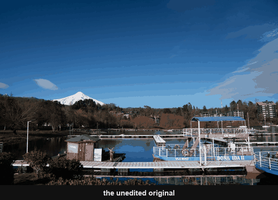
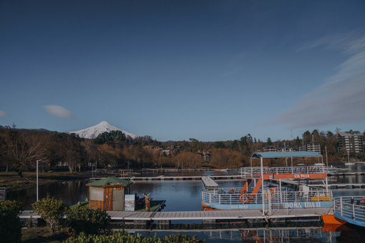
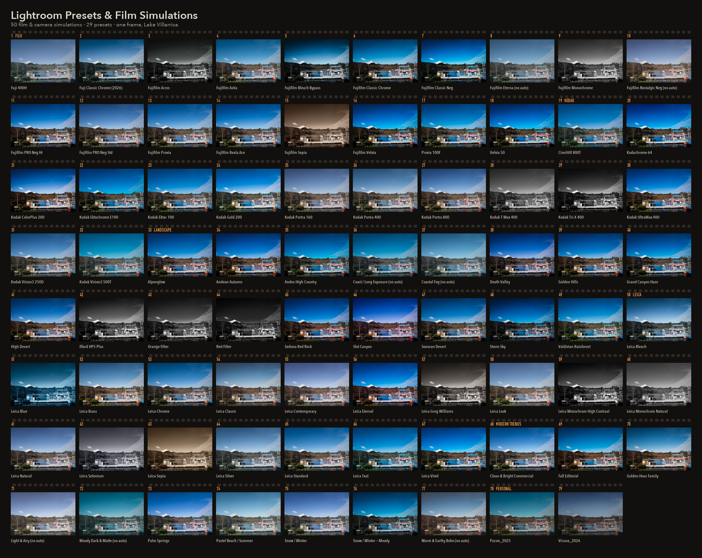

# Lightroom Presets & Film Simulations

The colour of Portra, the bite of Kodachrome, the cool restraint of a Leica
Monochrom — **50 film & camera simulations**, built from the way these films
and cameras actually render light, and **29 presets** that are looks of their own.
For Lightroom, on RAW from any camera.

 
<b>One photograph, many looks.</b> Every image here is the same frame —
<a href="samples/DSC04687_original.jpg">the original, untouched</a> — so what
changes between them is only the look.

<b>Try every look on one photo:</b>
<a href="https://hstockeb.github.io/film-simulations-and-presets/simulations/"><b>▶&nbsp;Film&nbsp;simulations</b></a>
&nbsp;·&nbsp;
<a href="https://hstockeb.github.io/film-simulations-and-presets/presets/"><b>▶&nbsp;Presets</b></a>
&nbsp;&nbsp;·&nbsp;&nbsp;
<a href="https://github.com/hstockeb/film-simulations-and-presets/releases/latest"><b>⬇&nbsp;Download all 79 (.zip)</b></a>

Lightroom Classic &amp; CC · works on RAW from <b>any camera</b> ·
your white balance is never touched · <a href="LICENSE">free to use, CC BY 4.0</a>

## The families

<!-- gallery:start -->

### Film & camera simulations · 50

Emulations of real film stocks and of camera makers' built-in looks.

<table>
<tr>
<td width="33%" align="center"> <b>Fuji</b> camera film simulations + the film stocks they were named after <a href="presets/Fuji/README.md"><b>18 presets →</b></a></td>
<td width="33%" align="center"> <b>Kodak</b> negative, slide and cine emulsions <a href="presets/Kodak/README.md"><b>14 presets →</b></a></td>
<td width="33%" align="center"> <b>Leica</b> the aesthetic direction of Leica's in-camera Looks <a href="presets/Leica/README.md"><b>18 presets →</b></a></td>
</tr>
</table>

### Presets · 29

Looks of their own — not modelled on any film or camera.

<table>
<tr>
<td width="33%" align="center"> <b>Landscape</b> land-first colour — green as a subject, not a distraction <a href="presets/Landscape/README.md"><b>17 presets →</b></a></td>
<td width="33%" align="center"> <b>Modern Trends</b> current editorial and social looks <a href="presets/Modern%20Trends/README.md"><b>10 presets →</b></a></td>
<td width="33%" align="center"> <b>Personal</b> hand-built from single trips — not camera-agnostic <a href="presets/Personal/README.md"><b>2 presets →</b></a></td>
</tr>
</table>

<!-- gallery:end -->

## Every look at once

All 79 on one sheet, numbered in family order. Click for full size, or
<a href="https://hstockeb.github.io/film-simulations-and-presets/">drag across them one at a time</a>.

## Install

[Download a .zip](https://github.com/hstockeb/film-simulations-and-presets/releases/latest) — everything, or one family. Lightroom imports the zip
as it is; there is no need to unpack it.

- **Lightroom Classic** — Develop → Presets panel → right-click → *Import Presets*
- **Lightroom CC / mobile** — Presets → ⋮ → *Import Presets*

Import a whole family at once. Each preset knows which group it belongs to, so
they file themselves in the Presets panel.

## Getting the most out of them

A preset is a starting point, not a finished photograph. It sets the colour and
the mood; the exposure and the white balance are still yours to judge, frame by
frame.

**Set your white balance first.** These presets deliberately leave it alone —
every warm or cool cast here is built out of colour, not temperature, so your
own white balance always survives. Get the frame neutral (or push it warm for
taste) *before* you judge the look, or you'll be judging two decisions at once.

**Then dial the strength.** The *Amount* slider at the top of the Presets panel
scales the whole look at once — curve, colour, grain, everything.

| Amount | What you get |
|---|---|
| 100 | as designed |
| 70–85 | the character, softened — a good default for portraits and weddings |
| 40–60 | just a hint of direction |
| 110–150 | pushes the gentler looks (Standard, Natural, Chrome) harder |

**Leave Auto Tone where it is.** Most of these re-judge exposure for each photo,
which is usually what you want. A handful — anything marked `(no auto)`, plus
`Snow / Winter — Moody` — are built on a deliberately lifted or deliberately
dark base that Auto would "correct" straight back to normal, killing the look.
Set the exposure by hand on those.

**When something looks off**, reach for the right control:

- too warm or too cool → Colour Grading *Global* saturation, a few points; never Temperature
- skin gone ruddy in the warmer looks → HSL *Red* saturation down 4
- highlights clipping → Highlights and Whites down, and watch the histogram
- feels flat → raise the Amount, or add a touch of Contrast

**Every sensor draws colour a little differently.** Expect to nudge a slider or
two by 3–5 points on some cameras. Nothing more than that.

## How they were made

**They work on any camera.** No camera-matching profile, no lens corrections,
nothing tied to one sensor — just Adobe Color or Adobe Monochrome underneath,
so a RAW from any maker gets the same look.

**Sharpening and noise reduction are left out on purpose.** How much a photo
needs depends on your sensor and your ISO, not on the look you're after. Set
those yourself; nothing here will overwrite them.

**Every recipe was researched, not eyeballed** — cross-referenced against
datasheets, film labs, photographers' notes and technical guides before it was
settled. Where a look is a manufacturer's, it's an honest approximation of how
that rendering behaves, built from scratch. No manufacturer profiles or LUTs are
copied or redistributed here.

The two in `Personal/` are the exception to all of this — hand-built from single
trips, tied to one camera, and kept exactly as they were used.

## About the sample images

Every image in this repo is the same photograph, taken on Lake Villarrica, so
the comparison is honest: what differs between any two is the recipe and nothing
else. They're all developed at the same exposure, so a look that appears darker
here genuinely is darker.

Films and camera-style names are used descriptively to say what a look is
reaching for. These are interpretations, made independently.

## License

[CC BY 4.0](LICENSE) — use them, change them, share them, including for paid
work. Just credit where they came from.
