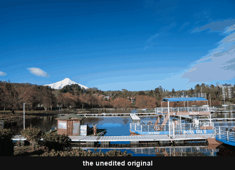

# Fuji

18 looks — 15 in colour, 3 in black & white. Works on RAW from any camera.

 <!-- family-loop -->

| Prefix | Looks |
|---|---|
| `Fujifilm - …` | The 15 in-camera film simulations: Provia · Astia · Velvia · Classic Chrome · Classic Chrome Street · PRO Neg Std · PRO Neg Hi · Classic Negative · Nostalgic Negative · Reala Ace · Eterna · Eterna Bleach Bypass · Acros · Monochrome · Sepia |
| `Fuji - …` | The 3 film-stock looks: 400H · Velvia 50 · Provia 100F |

Fuji's simulations only exist inside the camera's own JPEGs — shoot RAW and the
file comes out neutral, and outside a Fuji body they aren't available at all.
So these aren't copies. Each one is built from scratch, from how that simulation
is documented to behave, and checked against independent sources. Nothing of
Fuji's is redistributed here.

**Why two prefixes.** Fuji's *Velvia* and *Provia* simulations are named after
the films, and the films are emulated here too — `Fujifilm Velvia` (the camera's
punchy JPEG rendering) and `Velvia 50` (the slide film) are different looks. The
prefix carries into the ShortName so they stay apart in the Presets panel.

**Auto Tone is off in every simulation.** A film has a fixed response — Portra
is always soft with open shadows, Tri-X always punchy — and that response lives
in each preset's Basic sliders, which Auto would replace photo by photo. Set
your exposure, then apply; the film does the rest.

`Classic Chrome Street` is Classic Chrome pushed for the street: harder
contrast, cooler shadows and visible grain, where `Classic Chrome` is the
camera's own restrained rendering.

`Velvia 50` is the slide film, not the camera setting: it adds the film's
well-known magenta cast in the shadows, deeper blacks and a fine slide grain.

<!-- gallery:start -->

## Colour

<table>
<tr>
<td width="33%" align="center"> <b>Fuji 400H</b> <a href="../../presets/Fuji/Color/Fuji%20-%20400H.xmp">preset&nbsp;.xmp</a></td>
<td width="33%" align="center"> <b>Fujifilm Astia</b> <a href="../../presets/Fuji/Color/Fujifilm%20-%20Astia.xmp">preset&nbsp;.xmp</a></td>
<td width="33%" align="center"> <b>Fujifilm Bleach Bypass</b> <a href="../../presets/Fuji/Color/Fujifilm%20-%20Bleach_Bypass.xmp">preset&nbsp;.xmp</a></td>
</tr>
<tr>
<td width="33%" align="center"> <b>Fujifilm Classic Chrome</b> <a href="../../presets/Fuji/Color/Fujifilm%20-%20Classic_Chrome.xmp">preset&nbsp;.xmp</a></td>
<td width="33%" align="center"> <b>Fujifilm Classic Chrome Street</b> <a href="../../presets/Fuji/Color/Fujifilm%20-%20Classic_Chrome_Street.xmp">preset&nbsp;.xmp</a></td>
<td width="33%" align="center"> <b>Fujifilm Classic Neg</b> <a href="../../presets/Fuji/Color/Fujifilm%20-%20Classic_Neg.xmp">preset&nbsp;.xmp</a></td>
</tr>
<tr>
<td width="33%" align="center"> <b>Fujifilm Eterna</b> <a href="../../presets/Fuji/Color/Fujifilm%20-%20Eterna.xmp">preset&nbsp;.xmp</a></td>
<td width="33%" align="center"> <b>Fujifilm Nostalgic Neg</b> <a href="../../presets/Fuji/Color/Fujifilm%20-%20Nostalgic_Neg.xmp">preset&nbsp;.xmp</a></td>
<td width="33%" align="center"> <b>Fujifilm PRO Neg Hi</b> <a href="../../presets/Fuji/Color/Fujifilm%20-%20PRO_Neg_Hi.xmp">preset&nbsp;.xmp</a></td>
</tr>
<tr>
<td width="33%" align="center"> <b>Fujifilm PRO Neg Std</b> <a href="../../presets/Fuji/Color/Fujifilm%20-%20PRO_Neg_Std.xmp">preset&nbsp;.xmp</a></td>
<td width="33%" align="center"> <b>Fujifilm Provia</b> <a href="../../presets/Fuji/Color/Fujifilm%20-%20Provia.xmp">preset&nbsp;.xmp</a></td>
<td width="33%" align="center"> <b>Fujifilm Reala Ace</b> <a href="../../presets/Fuji/Color/Fujifilm%20-%20Reala_Ace.xmp">preset&nbsp;.xmp</a></td>
</tr>
<tr>
<td width="33%" align="center"> <b>Fujifilm Velvia</b> <a href="../../presets/Fuji/Color/Fujifilm%20-%20Velvia.xmp">preset&nbsp;.xmp</a></td>
<td width="33%" align="center"> <b>Provia 100F</b> <a href="../../presets/Fuji/Color/Fuji%20-%20Provia_100F.xmp">preset&nbsp;.xmp</a></td>
<td width="33%" align="center"> <b>Velvia 50</b> <a href="../../presets/Fuji/Color/Fuji%20-%20Velvia_50.xmp">preset&nbsp;.xmp</a></td>
</tr>
</table>

## Monochrome

<table>
<tr>
<td width="33%" align="center"> <b>Fujifilm Acros</b> <a href="../../presets/Fuji/Monochrome/Fujifilm%20-%20Acros.xmp">preset&nbsp;.xmp</a></td>
<td width="33%" align="center"> <b>Fujifilm Monochrome</b> <a href="../../presets/Fuji/Monochrome/Fujifilm%20-%20Monochrome.xmp">preset&nbsp;.xmp</a></td>
<td width="33%" align="center"> <b>Fujifilm Sepia</b> <a href="../../presets/Fuji/Monochrome/Fujifilm%20-%20Sepia.xmp">preset&nbsp;.xmp</a></td>
</tr>
</table>

<!-- gallery:end -->

[← all families](../../README.md)
