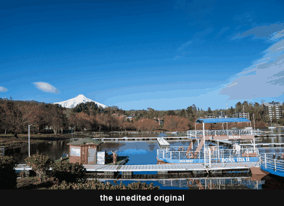

# Kodak

14 emulsions — 12 in colour, 2 in black & white. Auto Tone is off throughout.

 <!-- family-loop -->

| | Stocks |
|---|---|
| Negative | Portra 160 · Portra 400 · Portra 800 · Gold 200 · UltraMax 400 · ColorPlus 200 · Ektar 100 |
| Slide | Ektachrome E100 · Kodachrome 64 |
| Cine | Vision3 250D · Vision3 500T · CineStill 800T |
| Monochrome | Tri-X 400 · T-Max 400 |

Each recipe was cross-referenced against 4–8 independent sources — datasheets,
photographer blogs, film labs and technical editing guides — before it was
locked. Warmth and toning are built with colour science (Calibration + Colour
Grading + HSL), not the temperature slider, so the presets are safe for photos
shot at any time of day.

**Auto Tone is off in every simulation.** A film has a fixed response — Portra
is always soft with open shadows, Tri-X always punchy — and that response lives
in each preset's Basic sliders, which Auto would replace photo by photo. Set
your exposure, then apply; the film does the rest.

`CineStill 800T` is filed here because it *is* Vision3 500T, respooled with the
remjet layer removed — which is exactly where its halation around highlights
comes from, and why it belongs beside the two Vision3 presets.

<!-- gallery:start -->

## Colour

<table>
<tr>
<td width="33%" align="center"> <b>CineStill 800T</b> <a href="../../presets/Kodak/Color/Kodak%20-%20CineStill_800T.xmp">preset&nbsp;.xmp</a></td>
<td width="33%" align="center"> <b>Kodachrome 64</b> <a href="../../presets/Kodak/Color/Kodak%20-%20Kodachrome_64.xmp">preset&nbsp;.xmp</a></td>
<td width="33%" align="center"> <b>Kodak ColorPlus 200</b> <a href="../../presets/Kodak/Color/Kodak%20-%20ColorPlus_200.xmp">preset&nbsp;.xmp</a></td>
</tr>
<tr>
<td width="33%" align="center"> <b>Kodak Ektachrome E100</b> <a href="../../presets/Kodak/Color/Kodak%20-%20Ektachrome_E100.xmp">preset&nbsp;.xmp</a></td>
<td width="33%" align="center"> <b>Kodak Ektar 100</b> <a href="../../presets/Kodak/Color/Kodak%20-%20Ektar_100.xmp">preset&nbsp;.xmp</a></td>
<td width="33%" align="center"> <b>Kodak Gold 200</b> <a href="../../presets/Kodak/Color/Kodak%20-%20Gold_200.xmp">preset&nbsp;.xmp</a></td>
</tr>
<tr>
<td width="33%" align="center"> <b>Kodak Portra 160</b> <a href="../../presets/Kodak/Color/Kodak%20-%20Portra_160.xmp">preset&nbsp;.xmp</a></td>
<td width="33%" align="center"> <b>Kodak Portra 400</b> <a href="../../presets/Kodak/Color/Kodak%20-%20Portra_400.xmp">preset&nbsp;.xmp</a></td>
<td width="33%" align="center"> <b>Kodak Portra 800</b> <a href="../../presets/Kodak/Color/Kodak%20-%20Portra_800.xmp">preset&nbsp;.xmp</a></td>
</tr>
<tr>
<td width="33%" align="center"> <b>Kodak UltraMax 400</b> <a href="../../presets/Kodak/Color/Kodak%20-%20UltraMax_400.xmp">preset&nbsp;.xmp</a></td>
<td width="33%" align="center"> <b>Kodak Vision3 250D</b> <a href="../../presets/Kodak/Color/Kodak%20-%20Vision3_250D.xmp">preset&nbsp;.xmp</a></td>
<td width="33%" align="center"> <b>Kodak Vision3 500T</b> <a href="../../presets/Kodak/Color/Kodak%20-%20Vision3_500T.xmp">preset&nbsp;.xmp</a></td>
</tr>
</table>

## Monochrome

<table>
<tr>
<td width="33%" align="center"> <b>Kodak T-Max 400</b> <a href="../../presets/Kodak/Monochrome/Kodak%20-%20T-Max_400.xmp">preset&nbsp;.xmp</a></td>
<td width="33%" align="center"> <b>Kodak Tri-X 400</b> <a href="../../presets/Kodak/Monochrome/Kodak%20-%20Tri-X_400.xmp">preset&nbsp;.xmp</a></td>
<td width="33%"></td>
</tr>
</table>

<!-- gallery:end -->

[← all families](../../README.md)
