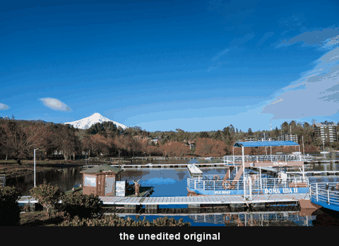

# Landscape

17 looks — 14 in colour, 3 in black & white. Built for land, not for faces.

 <!-- family-loop -->

| | Looks |
|---|---|
| General | Andes High Country · Valdivian Rainforest · Coast / Long Exposure (no auto) · High Desert · Storm Sky · Alpenglow · Andean Autumn |
| American Southwest | Sedona Red Rock · Slot Canyon · Sonoran Desert · Grand Canyon Haze |
| California | Coastal Fog (no auto) · Golden Hills · Death Valley |
| Monochrome | Ilford HP5 Plus · Red Filter · Orange Filter |

**Why a separate family.** The rest of the repo is tuned for people: 38 of its
49 colour presets *desaturate* green, which is what you do to stop foliage
competing with skin. For landscape that is backwards — green wants to be rich
and, more importantly, **separated**, so a hillside reads as depth rather than
one flat mass. `Valdivian Rainforest` pushes yellow toward green and green
toward aqua to spread the yellow-greens away from the blue-greens, while
`High Desert` and `Andean Autumn` still pull green down deliberately, because
there green should recede.

Deep skies come from **blue luminance** rather than a graduated filter — more
precise, and more natural. Dehaze stays moderate, paired with Texture for cloud
structure instead of carrying a sky on its own.

### Notes on individual looks

`Sedona Red Rock` is led by **red**, not the ochre orange of `High Desert` —
Sedona's colour is hematite staining the sandstone, so red saturation runs +20
against High Desert's +8.

`Slot Canyon` is the purple one (+22, the strongest in the repo). Canyon walls
act as reflector and colour filter at once, and deeper in the passage the
reflected light shifts from amber to purple — those purples are real and should
be kept. The usual way slot canyon photos are ruined is auto white balance
reading the orange sandstone as a cast and neutralising it to grey-cyan; leaving
WB at *As Shot* avoids that.

`Sonoran Desert` desaturates green while *raising* its luminance, which turns
saguaro and creosote into grey-sage rather than the mud you get from pulling
saturation alone. `Grand Canyon Haze` builds aerial perspective by cooling the
shadows and warming the highlights.

`Coastal Fog` and `Coast / Long Exposure` ship with Auto Tone **off**: fog *is*
low contrast and Auto reads that as a fault, and Auto re-solving exposure
defeats a deliberately long exposure. Coastal Fog runs the repo's strongest
negative Dehaze (−8), because there haze is the subject.

`Golden Hills` is led by **yellow** (+18 against Golden Hour Family's +8) for
dry summer straw, and carries none of that preset's skin-protecting moves —
there is no skin in a hillside. `Death Valley` pulls overall saturation down so
the banded minerals read as pastel, holding purple and magenta up for the
mineral seams.

The monochrome looks reproduce contrast filters through the Black & White Mix.
`Red Filter` drives blue sky toward black for maximum cloud separation, at the
cost of some cloud detail; `Orange Filter` is the middle ground that keeps it.
`Ilford HP5 Plus` is the film of the three — grainier, flatter in the toe, and
the one to reach for when the frame has weather in it rather than a clean sky.

<!-- gallery:start -->

## Colour

<table>
<tr>
<td width="33%" align="center"> <b>Alpenglow</b> <a href="../../presets/Landscape/Color/Landscape%20-%20Alpenglow.xmp">preset&nbsp;.xmp</a></td>
<td width="33%" align="center"> <b>Andean Autumn</b> <a href="../../presets/Landscape/Color/Landscape%20-%20Andean_Autumn.xmp">preset&nbsp;.xmp</a></td>
<td width="33%" align="center"> <b>Andes High Country</b> <a href="../../presets/Landscape/Color/Landscape%20-%20Andes_High_Country.xmp">preset&nbsp;.xmp</a></td>
</tr>
<tr>
<td width="33%" align="center"> <b>Coast / Long Exposure (no auto)</b> <a href="../../presets/Landscape/Color/Landscape%20-%20Coast_Long_Exposure%20%28no%20auto%29.xmp">preset&nbsp;.xmp</a></td>
<td width="33%" align="center"> <b>Coastal Fog (no auto)</b> <a href="../../presets/Landscape/Color/Landscape%20-%20Coastal_Fog%20%28no%20auto%29.xmp">preset&nbsp;.xmp</a></td>
<td width="33%" align="center"> <b>Death Valley</b> <a href="../../presets/Landscape/Color/Landscape%20-%20Death_Valley.xmp">preset&nbsp;.xmp</a></td>
</tr>
<tr>
<td width="33%" align="center"> <b>Golden Hills</b> <a href="../../presets/Landscape/Color/Landscape%20-%20Golden_Hills.xmp">preset&nbsp;.xmp</a></td>
<td width="33%" align="center"> <b>Grand Canyon Haze</b> <a href="../../presets/Landscape/Color/Landscape%20-%20Grand_Canyon_Haze.xmp">preset&nbsp;.xmp</a></td>
<td width="33%" align="center"> <b>High Desert</b> <a href="../../presets/Landscape/Color/Landscape%20-%20High_Desert.xmp">preset&nbsp;.xmp</a></td>
</tr>
<tr>
<td width="33%" align="center"> <b>Sedona Red Rock</b> <a href="../../presets/Landscape/Color/Landscape%20-%20Sedona_Red_Rock.xmp">preset&nbsp;.xmp</a></td>
<td width="33%" align="center"> <b>Slot Canyon</b> <a href="../../presets/Landscape/Color/Landscape%20-%20Slot_Canyon.xmp">preset&nbsp;.xmp</a></td>
<td width="33%" align="center"> <b>Sonoran Desert</b> <a href="../../presets/Landscape/Color/Landscape%20-%20Sonoran_Desert.xmp">preset&nbsp;.xmp</a></td>
</tr>
<tr>
<td width="33%" align="center"> <b>Storm Sky</b> <a href="../../presets/Landscape/Color/Landscape%20-%20Storm_Sky.xmp">preset&nbsp;.xmp</a></td>
<td width="33%" align="center"> <b>Valdivian Rainforest</b> <a href="../../presets/Landscape/Color/Landscape%20-%20Valdivian_Rainforest.xmp">preset&nbsp;.xmp</a></td>
<td width="33%"></td>
</tr>
</table>

## Monochrome

<table>
<tr>
<td width="33%" align="center"> <b>Ilford HP5 Plus</b> <a href="../../presets/Landscape/Monochrome/Landscape%20-%20Ilford_HP5.xmp">preset&nbsp;.xmp</a></td>
<td width="33%" align="center"> <b>Orange Filter</b> <a href="../../presets/Landscape/Monochrome/Landscape%20-%20Orange_Filter.xmp">preset&nbsp;.xmp</a></td>
<td width="33%" align="center"> <b>Red Filter</b> <a href="../../presets/Landscape/Monochrome/Landscape%20-%20Red_Filter.xmp">preset&nbsp;.xmp</a></td>
</tr>
</table>

<!-- gallery:end -->

[← all families](../../README.md)
