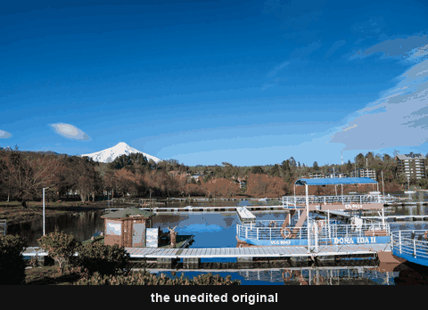

# Leica

18 looks — 12 in colour, 6 in black & white. Auto Tone stays on throughout.

 <!-- family-loop -->

| | Looks |
|---|---|
| Colour | Standard · Vivid · Natural · Chrome · Classic · Contemporary · Teal · Brass · Eternal · Silver · Bleach · Look |
| Monochrome | Monochrom Natural · Monochrom High Contrast · Selenium · Sepia · Blue · Greg Williams |

These reproduce the *aesthetic direction* of Leica's in-camera **Leica Looks**.
Leica Looks are baked into the JPEG, never the DNG, and Leica publishes no
values — each is a reasoned approximation of Leica's published descriptions,
cross-referenced against 5–8 independent sources per Look.

`Classic`, `Contemporary`, `Silver` and `Bleach` have a deliberately lifted,
washed base. If Auto lands a frame too contrasty, uncheck *Auto* in the Presets
panel before applying to get their baked tone values instead.

`Leica Look` is the general house look — the one to start from if you want the
rendering without committing to a named Look.

<!-- gallery:start -->

## Colour

<table>
<tr>
<td width="33%" align="center"> <b>Leica Bleach</b> <a href="../../presets/Leica/Color/Leica-style%20-%20Bleach.xmp">preset&nbsp;.xmp</a></td>
<td width="33%" align="center"> <b>Leica Brass</b> <a href="../../presets/Leica/Color/Leica-style%20-%20Brass.xmp">preset&nbsp;.xmp</a></td>
<td width="33%" align="center"> <b>Leica Chrome</b> <a href="../../presets/Leica/Color/Leica-style%20-%20Chrome.xmp">preset&nbsp;.xmp</a></td>
</tr>
<tr>
<td width="33%" align="center"> <b>Leica Classic</b> <a href="../../presets/Leica/Color/Leica-style%20-%20Classic.xmp">preset&nbsp;.xmp</a></td>
<td width="33%" align="center"> <b>Leica Contemporary</b> <a href="../../presets/Leica/Color/Leica-style%20-%20Contemporary.xmp">preset&nbsp;.xmp</a></td>
<td width="33%" align="center"> <b>Leica Eternal</b> <a href="../../presets/Leica/Color/Leica-style%20-%20Eternal.xmp">preset&nbsp;.xmp</a></td>
</tr>
<tr>
<td width="33%" align="center"> <b>Leica Look</b> <a href="../../presets/Leica/Color/Leica-style%20-%20Look.xmp">preset&nbsp;.xmp</a></td>
<td width="33%" align="center"> <b>Leica Natural</b> <a href="../../presets/Leica/Color/Leica-style%20-%20Natural.xmp">preset&nbsp;.xmp</a></td>
<td width="33%" align="center"> <b>Leica Silver</b> <a href="../../presets/Leica/Color/Leica-style%20-%20Silver.xmp">preset&nbsp;.xmp</a></td>
</tr>
<tr>
<td width="33%" align="center"> <b>Leica Standard</b> <a href="../../presets/Leica/Color/Leica-style%20-%20Standard.xmp">preset&nbsp;.xmp</a></td>
<td width="33%" align="center"> <b>Leica Teal</b> <a href="../../presets/Leica/Color/Leica-style%20-%20Teal.xmp">preset&nbsp;.xmp</a></td>
<td width="33%" align="center"> <b>Leica Vivid</b> <a href="../../presets/Leica/Color/Leica-style%20-%20Vivid.xmp">preset&nbsp;.xmp</a></td>
</tr>
</table>

## Monochrome

<table>
<tr>
<td width="33%" align="center"> <b>Leica Blue</b> <a href="../../presets/Leica/Monochrome/Leica-style%20-%20Blue.xmp">preset&nbsp;.xmp</a></td>
<td width="33%" align="center"> <b>Leica Greg Williams</b> <a href="../../presets/Leica/Monochrome/Leica-style%20-%20Greg%20Williams.xmp">preset&nbsp;.xmp</a></td>
<td width="33%" align="center"> <b>Leica Monochrom High Contrast</b> <a href="../../presets/Leica/Monochrome/Leica-style%20-%20Monochrom%20High%20Contrast.xmp">preset&nbsp;.xmp</a></td>
</tr>
<tr>
<td width="33%" align="center"> <b>Leica Monochrom Natural</b> <a href="../../presets/Leica/Monochrome/Leica-style%20-%20Monochrom%20Natural.xmp">preset&nbsp;.xmp</a></td>
<td width="33%" align="center"> <b>Leica Selenium</b> <a href="../../presets/Leica/Monochrome/Leica-style%20-%20Selenium.xmp">preset&nbsp;.xmp</a></td>
<td width="33%" align="center"> <b>Leica Sepia</b> <a href="../../presets/Leica/Monochrome/Leica-style%20-%20Sepia.xmp">preset&nbsp;.xmp</a></td>
</tr>
</table>

<!-- gallery:end -->

[← all families](../../README.md)
