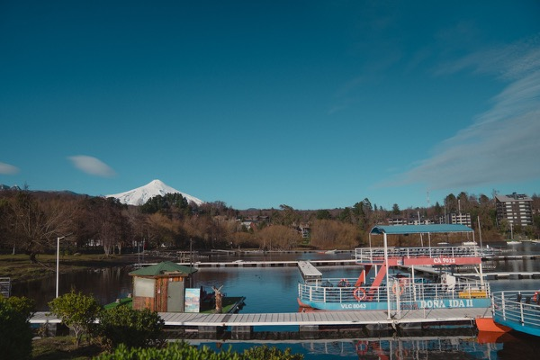

# Personal

2 looks, tied to one camera and kept exactly as they were used.

Built by hand from real trips — `Vicuna_2026` in the Elqui Valley high desert,
`Pucon_2025` in the Pucón lake district.

Unlike the rest of the repo these are **not camera-agnostic**, and are kept
exactly as they were used. Both carry A7R III sharpening and noise reduction,
lens corrections and per-channel RGB curves. `Vicuna_2026` additionally bakes in
a `Camera Portrait` camera-matching profile, a Custom white balance (5050 / +26),
the source frame's as-shot WB, and **HDR edit mode** — applying it switches
Lightroom into HDR editing.

Treat these two as personal references rather than general-purpose presets. They
are exempt from the repo's camera-agnostic and naming checks, by design.

<!-- gallery:start -->

<table>
<tr>
<td width="33%" align="center"> <b>Pucon_2025</b> <a href="../../presets/Personal/Pucon_2025.xmp">preset&nbsp;.xmp</a></td>
<td width="33%" align="center"> <b>Vicuna_2026</b> <a href="../../presets/Personal/Vicuna_2026.xmp">preset&nbsp;.xmp</a></td>
<td width="33%"></td>
</tr>
</table>

<!-- gallery:end -->

[← all families](../../README.md)
